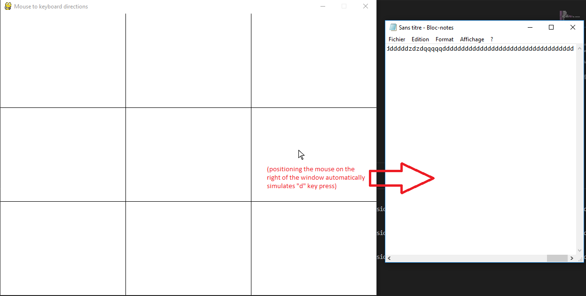

## Description

  

- Python software that converts mouse positioning to keyboard keys.

  

- Main goal was to play keyboard games with your mouse.

  

- If you position your mouse :

  

	- to the right of the window : it simulates the keypress "D" (Cf. Screenshot_1.png)

  

	- to the left : "Q"

  

	- to the bottom : "S"

  

	- to the top : "Z"

  

	- top-left (Z+Q), top-right (Z+D), etc...

  

-  

  

## Utilisation

  

- Start your game/application

  

- python main.py

  

- Right-click on the window to toggle (On/off) activation of keypresses
